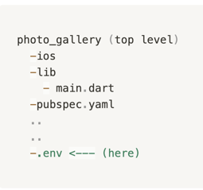

# Photo Gallery

A Photo Gallery App built using Unsplash public API.
You can join as developer and build your own app through [Unsplash Developers] (https://unsplash.com/developers)

## How to Run the app

- Create your own project on Unsplash
- Once you acquire an access key, create .env on the project level file and put the access key inside
  This is how it will look like:
    
- The value of .env file will be: `ACCESS_KEY` = `YOUR_KEY`
- Run `flutter pub get` 
- Run the app. 

### OR

You can contact me to help you further with it. [send me email] (mailto:victoriave.work@gmail.com)

## Miscellaneous

Here are some things you can play around with the app:
- You can change the thumbnails axis count by changing Grid axis count value inside [HomeDetailPage]
  I know it's not yet dynamic **sigh* but we can get there!
- Check app's responsiveness using DevicePreview by enabling it through [main.dart]
  Add `enabled: !kReleaseMode,` to run it on debug mode.
  And then you can select which kind of device's view you want to see!
